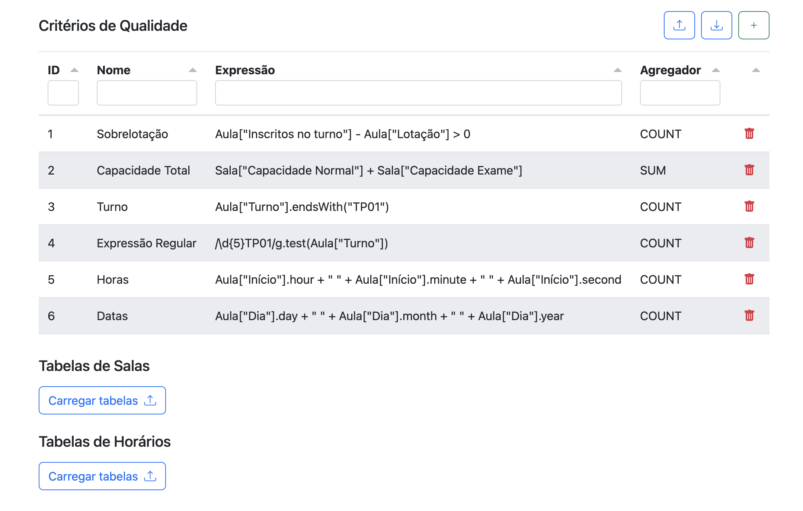
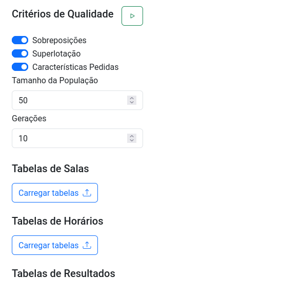

# Schedule Management

A aplicação _Schedule Management_ é uma página web que permite comparar a qualidade de diferentes horários, através de critérios totalmente configurados pelo utilizador.

Para visualizar essa página, o utilizador deve abrir o ficheiro _index.html_ no seu browser. Para isso, basta abrir o browser desejado (por exemplo, o Google Chrome) e arrastar o ficheiro do seu sistema de ficheiros para um separador novo no browser. Opcionalmente, pode simplesmente navegar até à pasta onde se encontra o ficheiro e abrir o mesmo com o browser desejado.

A página aberta no browser deverá ter um URL semelhante ao seguinte:

```console
file://{caminho para o ficheiro}/schedule-management/index.html
```

Se não conseguir visualizar corretamente a página, possivelmente dever-se-á a problemas com políticas CORS do seu browser. Alternativamente, poderá utilizar um servidor HTTP para carregar os ficheiros da aplicação.

Se tiver o VS Code instalado, poderá utilizar o [Live Server](https://marketplace.visualstudio.com/items?itemName=ritwickdey.LiveServer). Caso contrário, poderá também utilizar o [Python SimpleHTTPServer](https://docs.python.org/3/library/http.server.html#http.server.SimpleHTTPRequestHandler).

Se tiver conseguido abrir a página com sucesso, deverá visualizar algo semelhante ao seguinte:



Esta aplicação caracteriza-se por ser isenta de dependências externas, pelo que o seu deploy pode ser facilmente feito copiando a pasta raíz (_schedule-management_) e todos os seus conteúdos para o servidor pretendido. Todas as livrarias usadas encontram-se descarregadas na pasta _lib_, pelo que não é necessária qualquer instalação adicional.

# Genetic Algorithm

A aplicação _Schedule Management_ conta com uma página web auxiliar que permite criar novos horários utilizando algoritmo genético.

Para visualizar essa página, o utilizador deve abrir o ficheiro _genetic.html_ no seu browser utilizando o método explicado anteriormente.

Se tiver conseguido abrir a página com sucesso, deverá visualizar algo semelhante ao seguinte:


